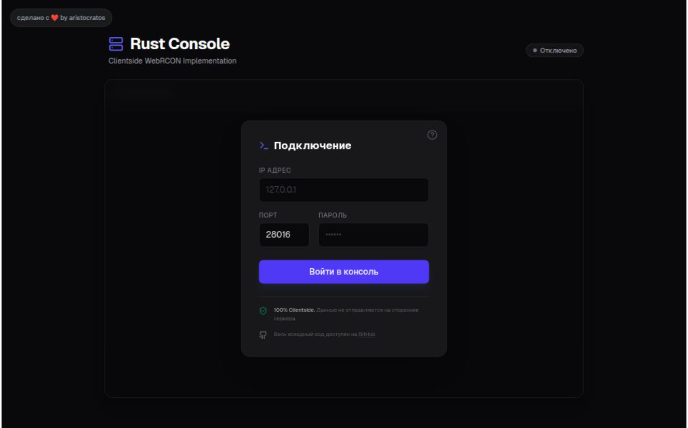

# Rust WebRcon Client


Современный, быстрый и безопасный веб-интерфейс для управления серверами Rust через протокол Websocket (WebRcon). Разработан с использованием **Next.js** и **Tailwind CSS**.

🔗 **[Демо](https://rcon.aristocratos.ru/)**



## Особенности

- **100% Clientside:** Все данные (IP, порты, пароли) обрабатываются только в вашем браузере. Никакие данные не отправляются на сторонние сервера или бэкенд сайта.
- **Realtime:** Мгновенное получение логов и отправка команд через WebSockets.
- **Современный UI:** Темная тем, адаптивный дизайн, красивая типографика.
- **Подсветка синтаксиса:** Автоматическое определение типов сообщений (Chat, Warning, Error, Generic).

## Установка и запуск

Для запуска проекта локально вам потребуется [Node.js](https://nodejs.org/) версии 18+.

1. **Клонируйте репозиторий:**

   ```bash
   git clone https://github.com/aristocratos/rust-rcon-client.git
   cd rust-rcon-client
   ```

2. **Установите зависимости:**

   ```bash
   npm install
   # или
   yarn install
   # или
   pnpm install
   ```

3. **Запустите сервер разработки:**

   ```bash
   npm run dev
   ```

4. Откройте [http://localhost:3000](http://localhost:3000) в браузере.

## Настройка сервера Rust

Чтобы подключиться к серверу через этот клиент, сервер Rust должен быть запущен с поддержкой WebRcon. Добавьте следующие параметры в файл запуска (`.bat` / `.sh`) или `server.cfg`:

```text
+rcon.web 1
+rcon.port 28016
+rcon.password "ваш_пароль"
```

## Контрибьютинг

Приветствую любые вклады! Если вы нашли баг или хотите предложить улучшение:

1. Форкните репозиторий.
2. Создайте ветку для вашей фичи (`git checkout -b feature/AmazingFeature`).
3. Закоммитьте изменения (`git commit -m 'Add some AmazingFeature'`).
4. Запушьте ветку (`git push origin feature/AmazingFeature`).
5. Откройте Pull Request.

## Автор

Сделано с любовью от **[aristocratos](https://aristocratos.ru)**.

---

_Проект распространяется "как есть". Разработчик не несет ответственности за сохранность ваших паролей при использовании на скомпрометированных устройствах._
